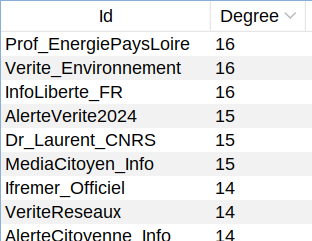
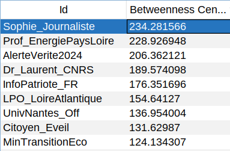
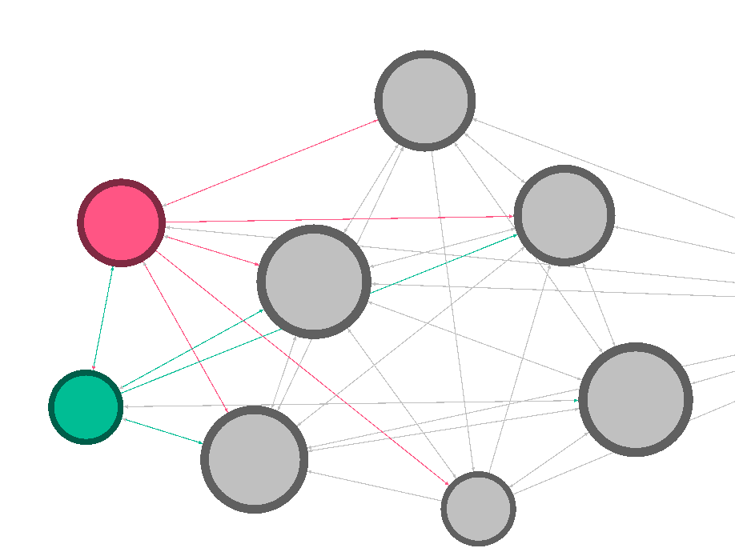

# Social Engineering - TD3 - Exercice 3

## Questions d’analyse

### 1. Structure du réseau

#### *Nombre de communautés détectées ?*

Il y a 5 communautés détectées, ce que l’on peut lire dans le *Modularity Report*.

> Results:
> 
> Modularity: 0.511
>
> Modularity with resolution: 0.511
>
> Number of Communities: 5

#### *Score de modularité global ?*

Le score de modularité global est de $0,512$.

#### *Présence de clusters ultra-denses (densité >0.7) ?*

En filtrant pour chaque cluster, on trouve :

- Cluster 0 : $0.75$ (louche)
- Cluster 1 : $0.25$ (normal)
- Cluster 2 : $0.833$ (très louche)
- Cluster 3 : $0.086$ (normal)
- Cluster 4 : $0.31$ (normal)

Les clusters 0 et 2 ont une densité anormale, suggérant fortement des CIB (Coordinated Inauthentic Behaviours).

### 2. Comptes centraux

#### *Top 5 par degré ?*

Par degré, le top 5 des comptes est :

1. InfoLiberte_FR, Prof_EnergiePaysLoire, Verite_Environnement (ex-aequo à 16)
2. AlerteVerite2024, Dr_Laurent_CNRS et MediaCitoyen_Info (ex-aequo à 15)

#### *Top 5 par betweenness ?*

#### *Ces comptes appartiennent-ils aux clusters suspects ?*

Plusieurs comptes appartiennent aux clusters suspects, mais pas tous. Parmi ceux qui appartiennent sont : Verite_Environnement, InfoLiberte_FR, MediaCitoyen_Info, AlerteVerite2024, InfoPatriote_FR.

### 3. Patterns de coordination

#### *Interactions majoritairement intra-cluster ou inter-cluster ?*

Les interactions sont majoritairement intra-cluster pour les clusters suspects.

#### *Présence d'amplification circulaire (A retweet B, B retweet C, C retweet A) ?*

Comme on peut le constater, il y a beaucoup d’amplification circulaire dans les clusters suspects. Par exemple, dans le cluster 0, en regardant l’orientation des edges :

#### *Synchronisation temporelle des interactions ?*

L’analyse du graphe d’interactions révèle une prédominance d’échanges intra-cluster, la présence de cycles d’amplification circulaire et une synchronisation temporelle marquée des interactions.